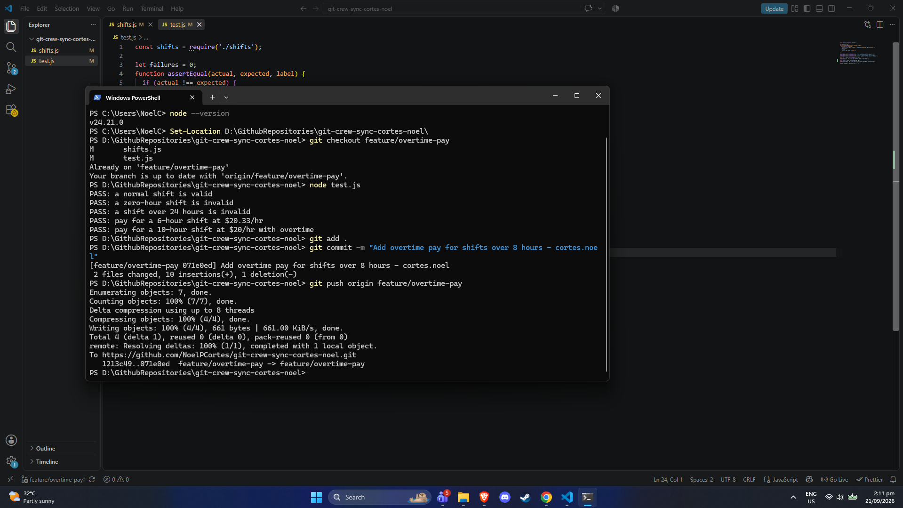
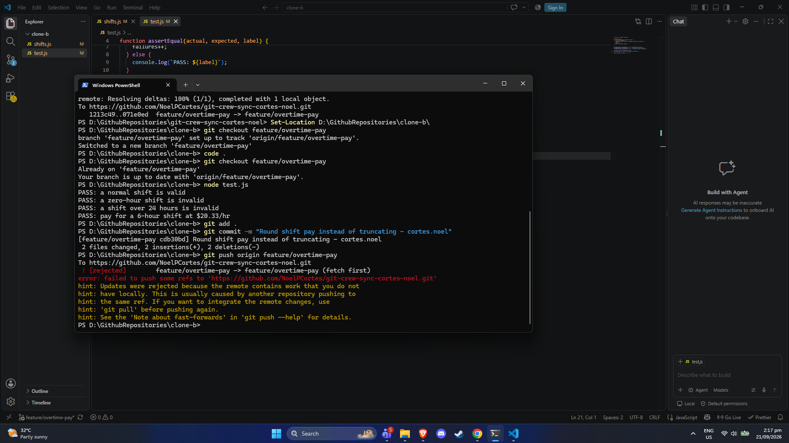
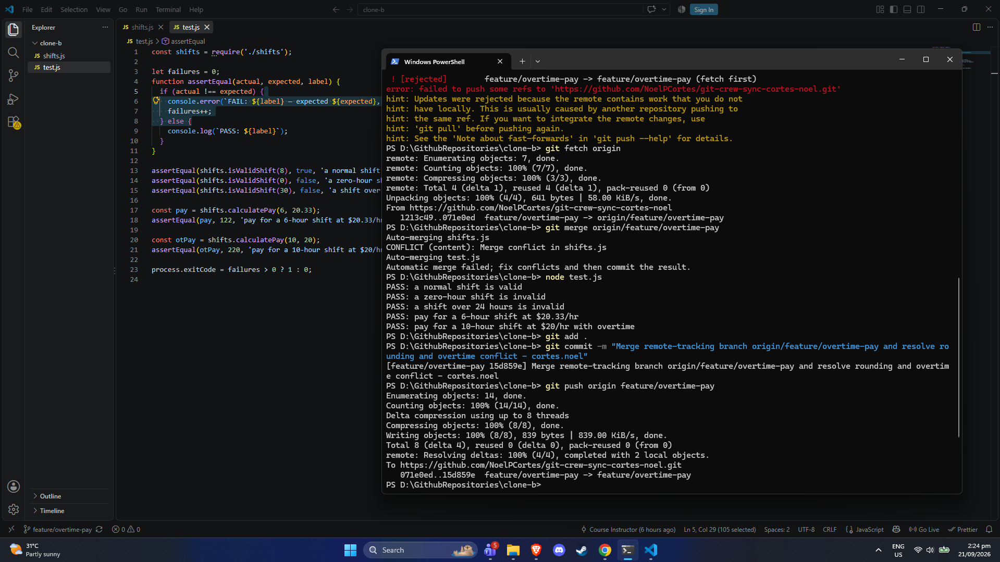
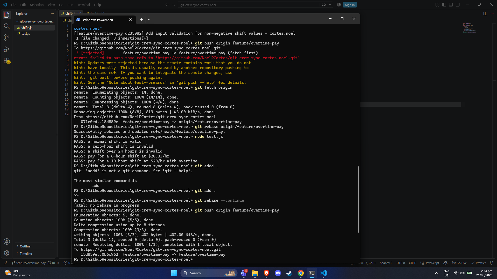
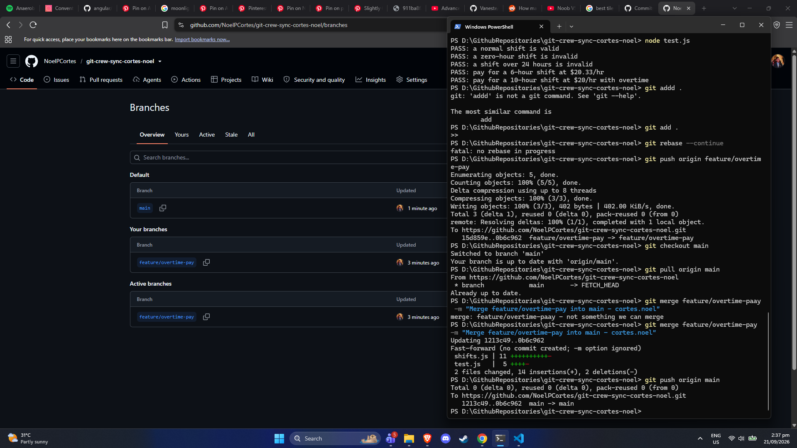
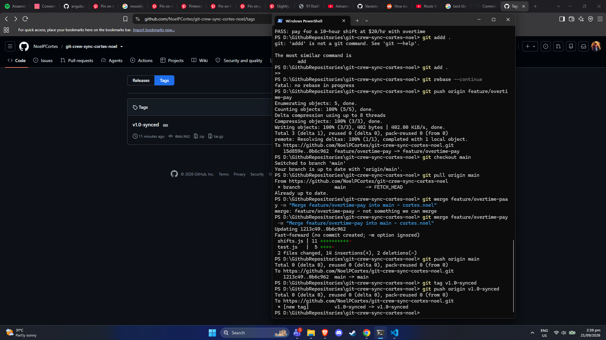

# Team Git Workflow Lab - cortes.noel

Task 1

Task 2

Task 3 

Task 4 

Task 5 

Task 6 

1. What did the rejected push error message tell you, and why did it happen?

The error message that displayed "[rejected - non-fast-forward]" and it stated that the remote contains work that does not exist locally. This usually happened when Git prevents overwriting commits on the remote repository when your local branch's base commit is behind from the main branch or a different branch. Another push had occurred, making a fast-forward update impossible without first integrating those commits.

2. What's the actual difference between how you resolved Task 3 (merge) vs Task 4 (rebase)?

- Task 3 is combined diverging branches by creating a merge commit that has two parent commits or two ahead commits. The commit histories and original timestamps of both branches were preserved as paths joining together.
- Task 4 rewrote the commit history. It temporarily set the local commit aside, updated the local base to match "origin/feature/overtime-pay", and then replayed the local commit on top of the newest remote commit. This created a commit history without generating an additional merge commit.

3. What one habit would have avoided both rejected pushes in this lab?

Always syncing with the remote branch "git pull" or "git fetch" and checking branch status, before starting new codes and immediately before pushing.

4. Which approach - merge or rebase - would you default to on a shared team branch, and why?

On a shared team branch "git merge" is the safer default. Rebasing alters commit hashes. if my teammates have already based their own work on the original commits, rewriting shared history causes difficulty recovery for my teammates. Merging preserves the true timeline of events and avoids modifying commits that have already been published or pushed.